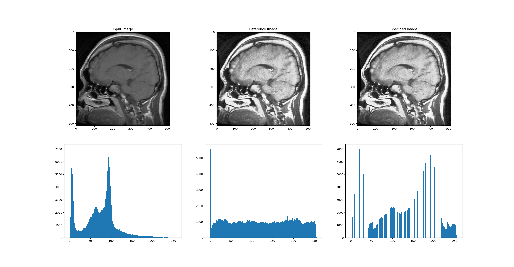
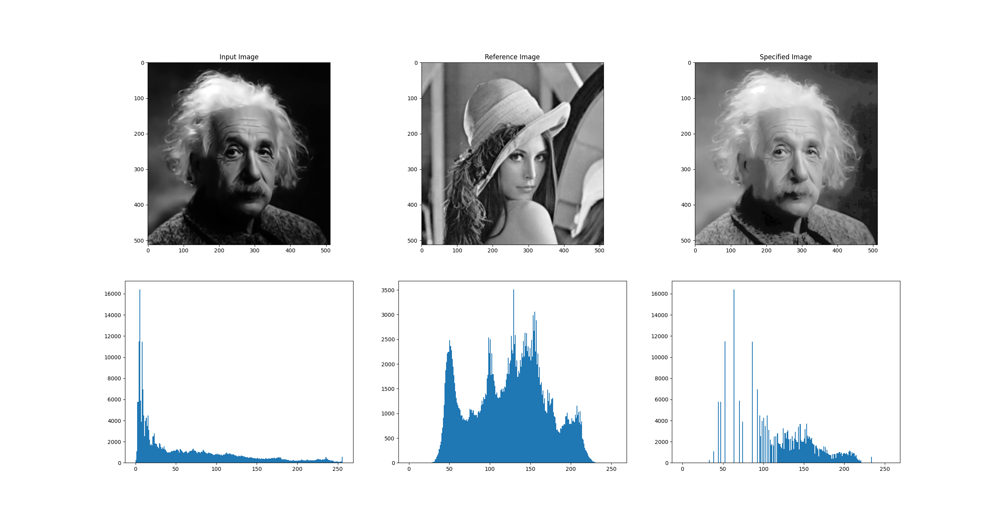

# Histogram Specification
Matching image A to B

# Installation
```
pip install numpy
pip install matplotlib
pip install scikit-image
```

# Implementation
Set options in main.py

1. Data type ('brain' or 'human)
2. Method (1 or 2)
   method == 1 : Using a Scikit-image library
   method == 2 : Traditional method

Run main.py

# Results

Brain data A to B


Human data A to B
